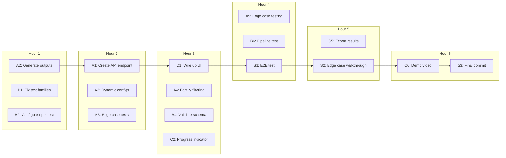

# 6-Hour MVP Sprint Plan

## Current State Summary


| Component         | Status       | Blocker                            |
| ----------------- | ------------ | ---------------------------------- |
| UI/Dashboard      | 85% complete | No backend integration             |
| Probe Runner      | Ready        | Not callable from UI               |
| Analysis Pipeline | Ready        | No outputs generated yet           |
| 200-Prompt Suite  | Ready        | `data/prompts/prompt-suite.json`   |
| Output Files      | Missing      | `/output/` directory doesn't exist |


**Critical Gap:** The UI's "Run Simulation" button only refreshes data - it doesn't trigger the actual probe runner. There's no API endpoint to run simulations.

---

## Hour-by-Hour Timeline

### Hours 1-2: Backend Integration (Person A + B in parallel)

### Hours 3-4: Testing and Edge Cases (All)

### Hours 5-6: Polish, Demo, and Submission (All)

---

## Person A (Chris) - Tasks

### A1. Create Run Simulation API Endpoint (Hour 1-2) - Critical

Create `app/api/run-simulation/route.ts` that:

1. Accepts POST with `{ configA, configB, promptFamily?, seed? }`
2. Writes configs to temp files or uses in-memory
3. Calls probe runner functions directly (not CLI)
4. Calls analysis functions
5. Returns results or triggers file generation

**Implementation approach:**

```typescript
// app/api/run-simulation/route.ts
import { runAllProbes, loadPrompts, setMode, setSeed } from "@/src/lib/probe-runner";
import { getEnhancedRules, evaluateAllRules } from "@/src/lib/rules-engine";
import { buildBreakFirstTimeline } from "@/src/lib/timeline";
import { runAnalysis, runComparisons, runDistributions } from "@/src/lib/analysis";

export async function POST(req: NextRequest) {
  const { configA, configB, seed = 42 } = await req.json();
  
  setMode("simulate");
  setSeed(seed);
  
  const prompts = loadPrompts("data/prompts/prompt-suite.json");
  const configs = [configA, configB];
  
  // Run probes
  const results = await runAllProbes(configs, prompts);
  
  // Evaluate rules
  const configMap = new Map(configs.map(c => [c.id, c]));
  const rules = getEnhancedRules(configMap);
  const events = evaluateAllRules(results, rules);
  
  // Build timeline
  const timeline = buildBreakFirstTimeline(events);
  
  // Run analysis
  const analysis = runAnalysis(events, prompts);
  const statsList = Object.values(analysis.configs);
  const comparisons = runComparisons(statsList);
  const distributions = runDistributions(events, prompts);
  
  // Write to output/ for other endpoints OR return directly
  return NextResponse.json({ analysis, comparisons, distributions, timeline });
}
```

---

### A2. Generate Initial Output Files (Hour 1) - Critical

Run the CLI once to generate baseline output files so UI works immediately:

```bash
npm run probes -- --mode simulate --seed 42 --prompts data/prompts/prompt-suite.json
npm run analyze
```

This creates:

- `output/failure-events.json`
- `output/break-first-timeline.json`
- `output/analysis.json`
- `output/comparisons.json`
- `output/distributions.json`

---

### A3. Fix Probe Runner for Dynamic Configs (Hour 2)

Current `loadConfigs()` reads from `configs/` directory. Add function to accept configs directly:

```typescript
// In probe-runner.ts
export async function runProbesWithConfigs(
  configs: ProbeConfig[],
  prompts: PromptRecord[]
): Promise<ProbeResult[]> {
  // Same as runAllProbes but accepts configs directly
}
```

---

### A4. Add Prompt Family Filtering (Hour 3)

Allow filtering prompts by family for the UI's prompt selector:

```typescript
export function filterPromptsByFamily(
  prompts: PromptRecord[],
  family: string
): PromptRecord[] {
  if (family === "all") return prompts;
  return prompts.filter(p => p.family === family);
}
```

---

### A5. Edge Case Testing (Hour 4)

Test scenarios:

- Empty prompt suite
- Config with extreme values (context_window = 1, top_k = 100)
- All failures vs no failures
- Single config (no comparison)

---

## Person B (Emil) - Tasks

### B1. Fix Test Family Mismatch (Hour 1) - Quick Fix

Update `tests/statistics.test.ts` line 33:

```typescript
// Change from:
{ id: "p_001", family: "short_plain", ... }

// To match actual suite:
{ id: "p_001", family: "short", ... }
```

Also update other mock families to match the 8 families in `prompt-suite.json`:

- `short_plain`, `short_tool_heavy`, `short_doc_grounded`, `short_tool_and_doc`
- `long_plain`, `long_tool_heavy`, `long_doc_grounded`, `long_tool_and_doc`

---

### B2. Configure npm test Command (Hour 1) - Quick Fix

Update `package.json`:

```json
"scripts": {
  "test": "npx tsx tests/statistics.test.ts",
  ...
}
```

---

### B3. Add Edge Case Tests (Hour 2)

Add tests for:

- Single config (no comparisons possible)
- 100% failure rate
- 0% failure rate
- Very small n (n=1, n=2)
- Custom alpha values (0.01, 0.1)

```typescript
function testEdgeCases(): void {
  // Single config - no comparisons
  const singleConfig = [{ config_id: "A", k: 5, n: 10, phat: 0.5 }];
  const comp = runComparisons(singleConfig);
  assert.strictEqual(comp.comparisons.length, 0, "Single config = no comparisons");
  
  // 100% failure rate
  const allFail = estimatePhat([...events100Percent], "A", 10);
  assert.strictEqual(allFail.phat, 1.0);
  
  // 0% failure rate
  const noFail = estimatePhat([], "A", 10);
  assert.strictEqual(noFail.phat, 0);
}
```

---

### B4. Validate Analysis Output Schema (Hour 3)

Ensure `analysis.json` schema matches what the UI expects:

```typescript
// Verify structure matches types/dashboard.ts
interface AnalysisData {
  configs: Record<string, {
    config_id: string;
    k: number;
    n: number;
    phat: number;
    ci_bootstrap?: [number, number];
    ci_bayesian?: [number, number];
  }>;
}
```

---

### B5. Support Dynamic Prompt Count (Hour 3)

The UI might run with subset of prompts. Ensure `n` (total trials) is calculated correctly:

```typescript
// In runAnalysis - already handles this via prompts.length
const totalTrials = Array.isArray(prompts) ? prompts.length : 0;
```

Verify this works when `prompts` is filtered by family.

---

### B6. Run Full Pipeline Test (Hour 4)

```bash
# 1. Run statistics tests
npm test

# 2. Run probes
npm run probes -- --mode simulate --seed 42

# 3. Run analysis
npm run analyze

# 4. Verify outputs
cat output/analysis.json | jq '.configs | keys'
cat output/comparisons.json | jq '.comparisons | length'
```

---

## Person C (Yufei) - Tasks

### C1. Wire Up Run Simulation Button (Hour 2) - Critical

Update `app/page.tsx` `runSimulation()` to call the new API:

```typescript
const runSimulation = useCallback(async () => {
  setStatus("running");
  try {
    const response = await fetch('/api/run-simulation', {
      method: 'POST',
      headers: { 'Content-Type': 'application/json' },
      body: JSON.stringify({
        configA,
        configB,
        promptFamily: selectedPrompt,
        seed: 42,
      }),
    });
    
    if (!response.ok) throw new Error('Simulation failed');
    
    const { analysis, comparisons, distributions } = await response.json();
    setAnalysisData(analysis);
    setComparisonsData(comparisons);
    setDistributionsData(distributions);
    setStatus("success");
  } catch (err) {
    console.error('Simulation failed:', err);
    setStatus("failure");
  }
}, [configA, configB, selectedPrompt]);
```

---

### C2. Add Loading Progress Indicator (Hour 3)

For 200 prompts x 2 configs = 400 probes, add progress feedback:

```tsx
const [progress, setProgress] = useState(0);

// In runSimulation, use SSE or polling for progress
// Or show estimated time: "Running ~400 probes (est. 30s)..."
```

---

### C3. Handle Empty/Error States Gracefully (Hour 3)

Add better messaging when:

- No output files exist yet
- Simulation fails
- Zero failures detected (good news!)

```tsx
{comparisonsData?.comparisons.length === 0 && (
  <div className="text-center py-8">
    <p className="text-sm text-muted-foreground">
      No comparisons yet. Run a simulation to see results.
    </p>
  </div>
)}
```

---

### C4. Add Config Presets (Hour 4)

Add quick-select presets for common configs:

```typescript
const presets = {
  "gpt-4-default": { model: "gpt-4", context_window: 8192, ... },
  "gpt-4-large-context": { model: "gpt-4", context_window: 32768, ... },
  "gemini-pro": { model: "gemini-1.5-pro", context_window: 128000, ... },
};
```

---

### C5. Export Results (Hour 5)

Add export buttons for JSON and Markdown:

```tsx
const exportJSON = () => {
  const data = { analysis: analysisData, comparisons: comparisonsData, distributions: distributionsData };
  const blob = new Blob([JSON.stringify(data, null, 2)], { type: 'application/json' });
  saveAs(blob, 'simulation-results.json');
};

const exportMarkdown = () => {
  const md = `# Simulation Results\n\n## Config A vs Config B\n...`;
  const blob = new Blob([md], { type: 'text/markdown' });
  saveAs(blob, 'simulation-results.md');
};
```

---

### C6. Record Demo Video (Hour 6)

Record a 2-3 minute demo showing:

1. Dashboard overview
2. Editing Config A and Config B
3. Selecting prompt family
4. Running simulation
5. Viewing results (probability, charts, breakdown)
6. Exporting results

---

## Shared Tasks (All Team)

### S1. End-to-End Integration Test (Hour 4)

All team members verify:

```bash
# 1. Start dev server
npm run dev

# 2. Open http://localhost:3000
# 3. Click "Run Simulation"
# 4. Verify all charts populate
# 5. Modify configs and re-run
# 6. Verify results change
```

---

### S2. Edge Case Walkthrough (Hour 5)

Test these scenarios together:

- Extreme config values
- All prompt families
- Multiple consecutive runs
- Config with tools_enabled: true vs false

---

### S3. Final Commit and Push (Hour 6)

```bash
git add .
git commit -m "feat: complete MVP with full UI integration"
git push origin feature/probability-analytics
```

---

## Task Summary by Person

### Person A (Chris) - 5 Tasks


| Priority | Task                                      | Hours | Dependency |
| -------- | ----------------------------------------- | ----- | ---------- |
| Critical | A1. Create `/api/run-simulation` endpoint | 1-2   | None       |
| Critical | A2. Generate initial output files         | 1     | None       |
| High     | A3. Fix probe runner for dynamic configs  | 2     | A1         |
| Medium   | A4. Add prompt family filtering           | 3     | A1         |
| Medium   | A5. Edge case testing                     | 4     | A1-A4      |


### Person B (Emil) - 6 Tasks


| Priority | Task                                | Hours | Dependency |
| -------- | ----------------------------------- | ----- | ---------- |
| High     | B1. Fix test family mismatch        | 1     | None       |
| High     | B2. Configure npm test command      | 1     | None       |
| High     | B3. Add edge case tests             | 2     | B1-B2      |
| Medium   | B4. Validate analysis output schema | 3     | None       |
| Medium   | B5. Support dynamic prompt count    | 3     | None       |
| High     | B6. Run full pipeline test          | 4     | B1-B5      |


### Person C (Yufei) - 6 Tasks


| Priority | Task                               | Hours | Dependency |
| -------- | ---------------------------------- | ----- | ---------- |
| Critical | C1. Wire up Run Simulation button  | 2     | A1         |
| Medium   | C2. Add loading progress indicator | 3     | C1         |
| Medium   | C3. Handle empty/error states      | 3     | C1         |
| Low      | C4. Add config presets             | 4     | None       |
| Medium   | C5. Export results                 | 5     | None       |
| High     | C6. Record demo video              | 6     | All        |


---

## Critical Path




**Blocking dependencies:**

- C1 (UI integration) is blocked by A1 (API endpoint)
- S1 (E2E test) is blocked by C1
- C6 (demo video) is blocked by all tasks

---

## Definition of Done

MVP is complete when:

1. User can edit Config A and Config B in UI
2. User can select prompt family
3. User can click "Run Simulation" and see results
4. Dashboard shows: probability comparison, confidence bands, distribution charts, failure breakdown
5. All tests pass (`npm test`)
6. Demo video recorded
7. Code pushed to repository
