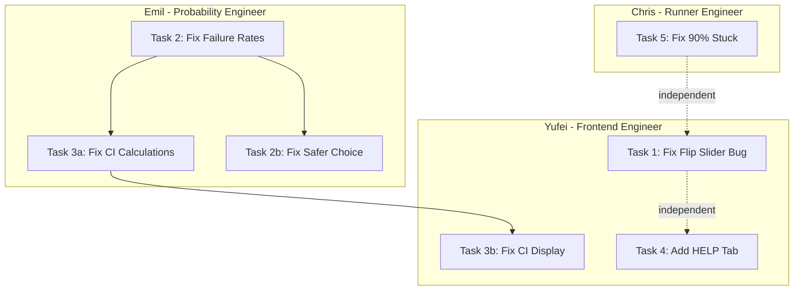

# BreakPoint Bug Fix Task Allocation

Allocate the 5 identified problems into detailed, fixable tasks distributed among Chris (Runner Engineer), Emil (Probability Engineer), and Yufei (Frontend Engineer) based on their defined roles.

## Problem Summary

| #   | Problem                                     | Root Cause                                           | Owner        |
| --- | ------------------------------------------- | ---------------------------------------------------- | ------------ |
| 1   | Horizontal slider appears on fast flip      | CSS transform conflict                               | Yufei        |
| 2   | Failure rate percentages are off (~35%/42%) | `totalTrials` mismatch in `estimatePhat()`            | Emil         |
| 3   | Confidence band stays the same              | CI values not updating OR display issue              | Emil + Yufei |
| 4   | Add HELP tab                                | New feature                                          | Yufei        |
| 5   | Stuck at 90% with real LLMs                 | Client-side progress estimation, no backend feedback | Chris        |

---

## Chris (Person A) - Runner + Rules Engineer

### Task 5: Fix "Stuck at 90%" Issue with Real LLMs

**Problem:** Progress bar stops at 90% and never completes when using real LLM mode.

**Root Cause Analysis:**

- Progress is purely client-side estimation (`page.tsx` lines 100-108)
- Progress increments by 2% every 600ms until 90%, then stops
- Real mode with rate limiting (200ms delay x prompts) takes much longer than estimated
- No real-time progress feedback from backend to frontend

**Files to modify:**

- [app/api/run-simulation/route.ts](app/api/run-simulation/route.ts) - Add progress tracking
- [src/lib/probe-runner.ts](src/lib/probe-runner.ts) - Add progress callback
- [app/page.tsx](app/page.tsx) - Better progress handling

**Subtasks:**

1. **Add progress callback to probe runner**
   - Modify `runAllProbes()` to accept an optional progress callback
   - Call callback with `{ completed, total }` after each probe
   - Keep console.log for debugging
2. **Improve client-side progress estimation**
   - Calculate estimated time based on mode (simulate ~30s, real ~120s)
   - Use dynamic increment rate based on total prompts
   - Increase cap from 90% to 95% or remove cap entirely
3. **Add timeout handling**
   - Set appropriate `maxDuration` for real mode (currently 60s, may need 180s+)
   - Add frontend timeout with user-friendly error message
   - Consider showing "Still processing..." after expected time

**Acceptance Criteria:**

- Progress bar completes to 100% for both simulate and real modes
- User sees progress feedback even during long real LLM runs
- Timeout errors are handled gracefully

---

## Emil (Person B) - Probability + Analytics Engineer

### Task 2: Fix Incorrect Failure Rate Percentages

**Problem:** Config A and Config B failure rates are always around 35% and 42% regardless of actual results.

**Root Cause Analysis:**

- `estimatePhat()` in [src/lib/probability.ts](src/lib/probability.ts) calculates `phat = k / n`
- `k` = unique prompts with failures, `n` = totalTrials parameter
- If `totalTrials` doesn't match actual probe runs, percentages are wrong
- The ~35%/42% values suggest `totalTrials` is fixed/hardcoded incorrectly

**Files to investigate and fix:**

- [src/lib/probability.ts](src/lib/probability.ts) - `estimatePhat()` function
- [src/lib/analysis.ts](src/lib/analysis.ts) - `runAnalysis()` that calls estimatePhat
- [app/api/run-simulation/route.ts](app/api/run-simulation/route.ts) - Check what totalTrials is passed

**Subtasks:**

1. **Audit `totalTrials` value**
   - Trace where `totalTrials` is set in `runAnalysis()`
   - Verify it matches `prompts.length` for the actual run
   - Check if there's a hardcoded value (e.g., 200 from the original prompt list)
2. **Fix `estimatePhat()` edge cases**
   - Ensure `k` count is per-config (not global)
   - Validate that config filtering is correct
   - Add logging to debug actual k/n values during simulation
3. **Add unit tests for failure rate calculation**
   - Test with known k/n values
   - Test edge cases: 0 failures, all failures, partial failures
   - Add to [tests/statistics.test.ts](tests/statistics.test.ts)

**Acceptance Criteria:**

- Failure rates match actual `k/n` calculations
- Different configs show different failure rates when they have different failure counts
- Unit tests validate correct behavior

---

### Task 3a: Fix Confidence Interval Calculations

**Problem:** Confidence band shows the same range regardless of config.

**Root Cause Analysis:**

- CIs are computed in `runAnalysis()` using `wilsonScoreCI`, `bootstrapCI`, `bayesianBetaCI`
- All three should produce different widths based on `k` and `n`
- If the underlying `k`/`n` values are wrong (Task 2), CIs will also be wrong
- Also possible: CIs are computed but not stored/passed correctly

**Files to modify:**

- [src/lib/statistics.ts](src/lib/statistics.ts) - CI calculation functions
- [src/lib/analysis.ts](src/lib/analysis.ts) - CI storage in results

**Subtasks:**

1. **Debug CI computation**
   - Add logging to see actual CI values computed
   - Verify CIs change with different k/n inputs
   - Check if `ci_wilson` is being stored in results
2. **Fix type definition mismatch**
   - `ConfigStats` interface in [types/dashboard.ts](types/dashboard.ts) is missing `ci_wilson`
   - Add `ci_wilson?: [number, number]` to the type
   - Ensure all CI types are consistent
3. **Ensure CIs are config-specific**
   - Verify `runAnalysis()` computes separate CIs for each config
   - Check that results are stored per config_id

**Acceptance Criteria:**

- CIs narrow as sample size increases
- CIs widen near p=0.5, narrow near p=0 or p=1
- Different configs have different CI ranges

---

### Task 2b: Fix Safer Choice Percentage

**Problem:** "Safer Choice" percentage doesn't reflect actual comparison.

**Root Cause Analysis:**

- `compareConfigs()` in `statistics.ts` uses Bayesian Beta sampling
- Returns `pASafer` = probability that Config A has lower failure rate
- Display logic in `probability-card.tsx` may not match configs correctly

**Files to modify:**

- [src/lib/statistics.ts](src/lib/statistics.ts) - `compareConfigs()` function
- [components/probability-card.tsx](components/probability-card.tsx) - Display logic

**Subtasks:**

1. **Verify Bayesian comparison is correct**
   - Ensure Beta parameters `(1+k, 1+n-k)` are correct
   - Check sampling uses correct distributions for each config
2. **Fix display matching logic**
   - In `probability-card.tsx`, verify `selectedConfigA` matches `currentComparison.config_a`
   - Handle swapped config case correctly
3. **Add unit tests for comparison**
   - Test case where A is clearly safer (low k_A, high k_B)
   - Test case where B is clearly safer
   - Test case where they're similar (expect ~50%)

**Acceptance Criteria:**

- If Config A has 10% failures and Config B has 50%, Safer Choice shows ~99% for A
- Percentage flips correctly when comparing B vs A

**Completion note (Emil left early; completed by Chris):**

- **Task 2:** Run-simulation already passes `trialsPerConfig` from `computeTrialsPerConfig(results)` to `runAnalysis()`, so failure rates use actual probe counts. Added unit test E3: different configs show different failure rates when k/n differ.
- **Task 3a:** Added `ci_wilson?: [number, number]` to `ConfigStats` in [types/dashboard.ts](types/dashboard.ts). Integration test now asserts `runAnalysis()` attaches `ci_wilson` for each config.
- **Task 2b:** ProbabilityCard display filtering (selected configs only) was fixed earlier. Added unit tests: B clearly safer → `pASafer < 0.5`; similar configs → P(A safer) near 50%.

---

## Yufei (Person C) - Frontend + Story Engineer

### Task 1: Fix Horizontal Slider Bug on Fast Flip

**Problem:** A horizontal slider appears below the run mode when clicking "Flip" or switching configs quickly.

**Root Cause Analysis:**

- FlipCard uses 3D CSS transforms with `perspective: 1000px`
- Both container and back card have `rotateY` transforms
- Fast clicking may cause transform state race conditions
- Possible overflow issue during transition

**Files to modify:**

- [components/flip-card.tsx](components/flip-card.tsx)

**Subtasks:**

1. **Investigate CSS transform conflict**
   - Check if both container and child have conflicting transforms
   - Test with `overflow: hidden` on the flip container
   - Add `transform-style: preserve-3d` if missing
2. **Add debounce to flip button**
   - Prevent rapid state changes during transition
   - Use `transition-duration` (currently unset) to determine debounce time
   - Disable button during transition (~500ms)
3. **Fix potential overflow**
   - Add `overflow: hidden` to flip card container
   - Ensure parent containers don't show scrollbar during animation
   - Check `backface-visibility: hidden` is set correctly

**Acceptance Criteria:**

- No horizontal slider appears on fast flip clicking
- Flip animation remains smooth
- Both configs are accessible after rapid clicks

---

### Task 3b: Fix Confidence Band Visual Display

**Problem:** Confidence band doesn't visually narrow or widen based on data.

**Root Cause Analysis:**

- [components/confidence-band.tsx](components/confidence-band.tsx) uses Recharts with stacked areas
- CI is selected: `ci_wilson ?? ci_bootstrap ?? ci_bayesian`
- Y-axis domain is dynamically calculated but may not update correctly
- Chart may not re-render when data changes

**Files to modify:**

- [components/confidence-band.tsx](components/confidence-band.tsx)

**Subtasks:**

1. **Verify data binding**
   - Check that `analysisData.configs` updates trigger re-render
   - Add `key` prop based on config IDs to force re-render
   - Log CI values to confirm they're different between configs
2. **Fix Y-axis domain calculation**
   - Current: `max 15% or maxUpper * 1.25`
   - May need config-specific domain for better visualization
   - Consider separate charts or dynamic scaling
3. **Ensure chart updates on config change**
   - Add React key to force remount when configs change
   - Check if Recharts needs explicit update trigger

**Acceptance Criteria:**

- Confidence band visually widens for uncertain estimates
- Confidence band visually narrows for confident estimates
- Band updates immediately when viewing different configs

---

### Task 4: Add HELP Tab

**Problem:** Users need guidance on how to use the simulator.

**Files to create/modify:**

- Create new [components/help-dialog.tsx](components/help-dialog.tsx)
- Modify [app/page.tsx](app/page.tsx) to add Help button

**Subtasks:**

1. **Create Help dialog component**
   - Use shadcn/ui `Dialog` or `Sheet` component
   - Include sections: Getting Started, Config Options, Understanding Results
   - Add tooltips for key metrics (failure rate, CI, safer choice)
2. **Add Help button to UI**
   - Place in header or as floating button
   - Use `HelpCircle` icon from lucide-react
   - Keyboard shortcut: `?` or `F1`
3. **Write help content**
   - Explain each config parameter (temperature, top-k, etc.)
   - Explain what failure rate and confidence band mean
   - Explain "Safer Choice" probability interpretation

**Acceptance Criteria:**

- Help is accessible from main page
- Content explains all major features
- Non-intrusive placement that doesn't block workflow

---

## Task Dependency Diagram

---

## Priority Order

1. **High Priority (Blocking):**
   - Task 2 (Emil): Failure rates are wrong - affects all other metrics
   - Task 5 (Chris): 90% stuck makes real LLM mode unusable
2. **Medium Priority (User Experience):**
   - Task 3a + 3b (Emil + Yufei): Confidence band issues
   - Task 1 (Yufei): Flip slider bug is annoying but not blocking
3. **Lower Priority (Enhancement):**
   - Task 4 (Yufei): HELP tab is nice-to-have
   - Task 2b (Emil): Safer choice depends on Task 2

---

## Summary by Person

| Person    | Tasks                       | Estimated Complexity                        |
| --------- | --------------------------- | ------------------------------------------- |
| **Chris** | Task 5 (90% stuck)          | Medium - requires backend progress tracking |
| **Emil**  | Task 2, 3a, 2b (Statistics) | High - core probability logic               |
| **Yufei** | Task 1, 3b, 4 (UI)          | Medium - CSS fixes + new component          |

---

## Task Checklist

- [ ] **Chris:** Fix 90% stuck issue - add progress callback to probe runner, improve client-side estimation, add timeout handling
- [x] **Emil:** Fix failure rate percentages - audit totalTrials value, fix estimatePhat() edge cases, add unit tests
- [x] **Emil:** Fix CI calculations - debug CI computation, fix type definition mismatch, ensure config-specific CIs
- [x] **Emil:** Fix Safer Choice percentage - verify Bayesian comparison, fix display matching logic
- [ ] **Yufei:** Fix horizontal slider bug - investigate CSS transform conflict, add debounce, fix overflow
- [ ] **Yufei:** Fix confidence band display - verify data binding, fix Y-axis domain, ensure chart updates
- [ ] **Yufei:** Add HELP tab - create dialog component, add button to UI, write help content
