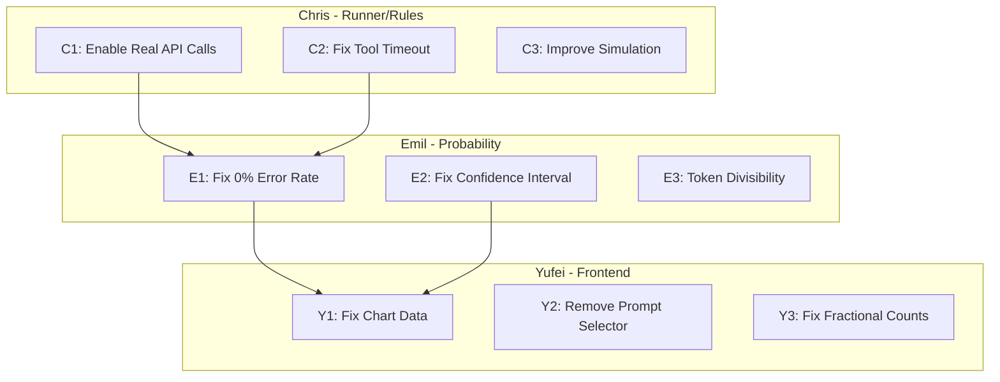

# BreakPoint Bug Fix - Task Allocation

## Team Roles Recap

- **Chris (Person A):** Runner + Rules Engineer - probe execution, telemetry, failure event generation
- **Emil (Person B):** Probability + Analytics Engineer - statistics, confidence intervals, distributions
- **Yufei (Person C):** Frontend + Story Engineer - UI, charts, user experience

---

## Chris's Tasks (Runner + Rules Engineer)

### Task C1: Enable Real Model API Calls (Critical)

**Issue:** Models are not actually running - the system always uses simulation mode

**Root Cause:** In [app/api/run-simulation/route.ts](app/api/run-simulation/route.ts), line 84 hardcodes `setMode("simulate")`, so real APIs are never called.

**Fix:**

1. Add a `mode` parameter to the API request body
2. Conditionally call `setMode("real")` when user wants real API calls
3. Ensure API keys are configured for OpenAI/Gemini/Manus in environment

**Files to modify:**

- `app/api/run-simulation/route.ts` - Add mode selection logic
- `src/lib/probe-runner.ts` - Verify real mode execution path works

---

### Task C2: Fix Tool Timeout Detection (Critical)

**Issue:** Tool Timeout Risk shows 10/10 events - this is a foundational error

**Root Cause:** 

- In simulation mode (`probe-runner.ts:262-264`): random 10% chance of timeouts
- In real API mode: `tool_timeouts` is always set to 0 or 1 on general errors, no actual timeout detection

**Fix:**

1. In simulation mode: Make tool timeout probability configurable and more realistic
2. In real API mode: Implement actual timeout detection for tool calls:
   - Add timeout wrapper around tool call execution
   - Track individual tool call durations
   - Set `tool_timeouts` based on actual timeouts (e.g., >30s)

**Files to modify:**

- `src/lib/probe-runner.ts` - Fix simulation timeout logic
- `src/lib/openai-client.ts` - Add tool call timeout tracking
- `src/lib/gemini-client.ts` - Add tool call timeout tracking
- `src/lib/manus-client.ts` - Add tool call timeout tracking

---

### Task C3: Improve Simulation Realism

**Issue:** Simulated data appears unrealistic ("seems like bullshit")

**Fix:**

1. Use more realistic base latency and token distributions
2. Add model-specific variance (different models should behave differently)
3. Ensure tool call counts are realistic (not always 1-5 random)
4. Add occasional failures that aren't just tool timeouts

**Files to modify:**

- `src/lib/probe-runner.ts` - `generateTelemetry()` function

---

## Emil's Tasks (Probability + Analytics Engineer)

### Task E1: Investigate 0% Error Rate Issue

**Issue:** Many models show 0% error rate - unlikely to be accurate

**Root Causes to investigate:**

1. If running simulation mode with perfect conditions → no failures generated
2. Configs with 0 failures only included if `allConfigIds` is passed
3. `totalTrials` might be incorrect due to prompt filtering

**Fix:**

1. Verify `totalTrials = prompts.length` is calculated correctly
2. Ensure all configs are included in analysis even with 0 failures
3. Add validation that `k <= n` relationships are correct
4. Add logging/debugging to track why certain configs show 0%

**Files to modify:**

- `src/lib/probability.ts` - `estimatePhat()` function
- `src/lib/analysis.ts` - `runAnalysis()` function

---

### Task E2: Fix Confidence Interval Calculation

**Issue:** Confidence intervals need to be fixed

**Current implementation:**

- Bootstrap CI: 1000 iterations, percentile-based
- Bayesian CI: Beta(1+k, 1+n-k) posterior with 10000 samples

**Potential issues:**

1. Percentile index calculation may need interpolation
2. Edge cases when `k=0` or `n=0` may produce misleading CIs
3. CI might be too narrow or too wide

**Fix:**

1. Review and validate percentile index calculation
2. Consider using Clopper-Pearson exact CI as alternative
3. Add unit tests for edge cases (k=0, k=n, small n)
4. Ensure CI bounds are clamped to [0, 1]

**Files to modify:**

- `src/lib/statistics.ts` - `bootstrapCI()` and `bayesianBetaCI()` functions
- `tests/statistics.test.ts` - Add comprehensive tests

---

### Task E3: Enforce Token Divisibility by 512

**Issue:** Token numbers should be divisible by 512

**Fix:**

1. Round token counts to nearest 512 in analysis output
2. Or validate/enforce 512-divisibility in telemetry generation

**Files to modify:**

- `src/lib/probability.ts` or `src/lib/analysis.ts` - Add rounding logic
- Alternatively: `src/lib/probe-runner.ts` - Generate tokens as multiples of 512

---

## Yufei's Tasks (Frontend + Story Engineer)

### Task Y1: Fix Charts Showing Same Data (Critical)

**Issue:** Distribution charts are identical regardless of model selection

**Root Cause:** `modeDistributions()` in `src/lib/analysis.ts` aggregates ALL failure events without filtering by `config_id`. The frontend passes no config filtering to `DistributionCharts`.

**Fix:**

1. Modify `modeDistributions()` to accept a `configId` parameter
2. Create separate distributions for Config A and Config B
3. Update `DistributionCharts` component to show per-config breakdowns
4. Pass selected config IDs from `page.tsx` to distribution components

**Files to modify:**

- `src/lib/analysis.ts` - Add config filtering to `modeDistributions()`
- `components/distribution-charts.tsx` - Accept and display per-config data
- `app/page.tsx` - Pass config IDs to distribution components
- `app/api/run-simulation/route.ts` - Return per-config distributions

---

### Task Y2: Remove Prompt Pool Selection

**Issue:** Users should not be able to choose prompt pools - always use all prompts

**Fix:**

1. Remove or hide the `PromptSelector` component from the UI
2. Hardcode `promptFamily: "all"` in the simulation request
3. Remove the prompt family dropdown from the config cards

**Files to modify:**

- `app/page.tsx` - Remove `<PromptSelector>` component usage
- Optionally: `components/prompt-selector.tsx` - Delete or comment out

---

### Task Y3: Fix Fractional Numbers in Count Charts

**Issue:** Charts with counts show fractional numbers like "0.75"

**Fix:**

1. Ensure count data uses integers (`Math.round()` or `Math.floor()`)
2. Update chart Y-axis to use integer ticks only
3. Format tooltips to show whole numbers

**Files to modify:**

- `components/distribution-charts.tsx` - Add `Math.round()` to count values
- Configure Recharts Y-axis with `allowDecimals={false}`

---

## Summary Table

| Task | Owner | Priority | Issue # | Key Files                                            |
| ---- | ----- | -------- | ------- | ---------------------------------------------------- |
| C1   | Chris | Critical | 3       | `route.ts`, `probe-runner.ts`                        |
| C2   | Chris | Critical | 2       | `probe-runner.ts`, `*-client.ts`                     |
| C3   | Chris | Medium   | 4       | `probe-runner.ts`                                    |
| E1   | Emil  | High     | 1       | `probability.ts`, `analysis.ts`                      |
| E2   | Emil  | High     | 9       | `statistics.ts`                                      |
| E3   | Emil  | Low      | 8       | `probability.ts` or `probe-runner.ts`                |
| Y1   | Yufei | Critical | 5       | `analysis.ts`, `distribution-charts.tsx`, `page.tsx` |
| Y2   | Yufei | Medium   | 6       | `page.tsx`, `prompt-selector.tsx`                    |
| Y3   | Yufei | Medium   | 7       | `distribution-charts.tsx`                            |

---

## Recommended Execution Order

**Phase 1 (Parallel):** Chris does C1+C2, Emil does E2, Yufei does Y2+Y3
**Phase 2:** Chris does C3, Emil does E1 (needs real data from C1/C2), Yufei does Y1 (needs analysis fixes from E1/E2)
**Phase 3:** Emil does E3, final integration testing
