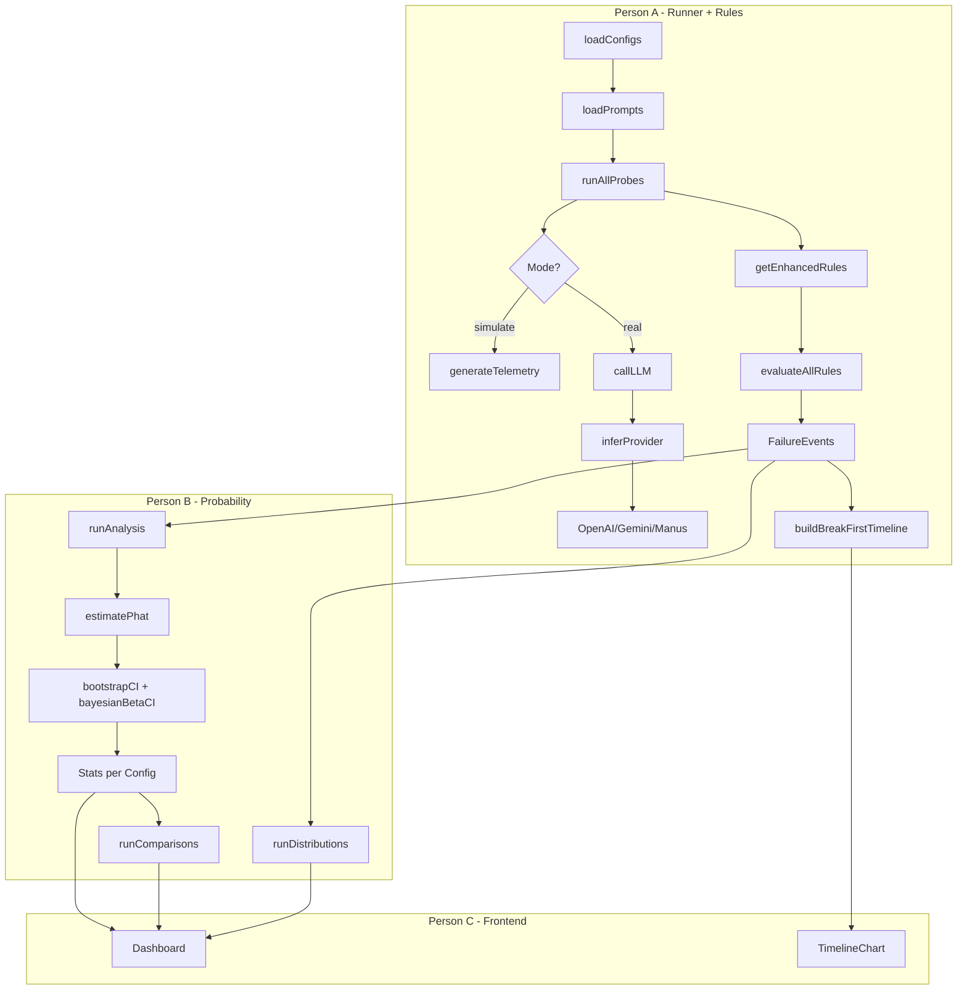

# Breakpoint Project Review - Team Assignment

## Team Reference (from MVP Requirements)


| Person | Name  | Role                    | Key Files                                                                               |
| ------ | ----- | ----------------------- | --------------------------------------------------------------------------------------- |
| **A**  | Chris | Runner + Rules Engineer | `probe-runner.ts`, `rules-engine.ts`, `telemetry-logger.ts`, `timeline.ts`, LLM clients |
| **B**  | Emil  | Probability + Analytics | `probability.ts`, `statistics.ts`, `analysis.ts`                                        |
| **C**  | Yufei | Frontend + Story        | `/app`, `/components`, `README.md`, Dashboard                                           |


---

## Person A (Chris) - Issues

### A1. Missing OpenAI SDK Dependency (Critical)

The `openai-client.ts` imports from `'openai'` but this package is missing from `package.json`:

```typescript
import OpenAI from "openai"; // Will fail at runtime
```

**Fix:** Run `npm install openai` or add `"openai": "^4.x"` to dependencies.

---

### A2. Type Safety Issue in Rules Engine (Medium)

`rules-engine.ts:134` uses weak typing:

```typescript
export function getEnhancedRules(configs: Map<string, any>): Rule[] {
```

**Fix:** Change signature to `Map<string, ProbeConfig>` and add import for `ProbeConfig`.

---

### A3. Incomplete Gemini Tool Tracking (Medium)

TODO at `gemini-client.ts:70`:

```typescript
// TODO: Track function calls when tools are enabled
tool_calls: 0, // Always 0, never actual count
```

This causes the `tool_timeout_risk` rule to never trigger for Gemini configs.

**Fix:** Parse Gemini response for function call metadata:

```typescript
tool_calls: response.candidates?.[0]?.content?.parts?.filter(p => p.functionCall)?.length ?? 0
```

---

### A4. Default Provider Fallback (Low)

In `llm-client.ts:31`, unknown model names silently default to `"gemini"`:

```typescript
return "gemini"; // Unexpected default for unknown models
```

**Fix:** Throw an error for unknown models or require explicit `provider` field:

```typescript
throw new Error(`Unknown model provider for: ${config.model}. Set 'provider' explicitly.`);
```

---

### A5. Deprecated Function Cleanup (Low)

`getDefaultRules()` in `rules-engine.ts` has a deprecation comment but no JSDoc tag:

```typescript
// This function is kept for compatibility but getEnhancedRules should be used instead
```

**Fix:** Add `@deprecated` JSDoc or remove if unused by any code path.

---

### A6. Missing Tests for Person A Modules (Medium)

Untested modules owned by Person A:

- `rules-engine.ts` - `evaluateRules()`, `getEnhancedRules()`
- `probe-runner.ts` - `loadConfigs()`, `runProbe()`
- `timeline.ts` - `buildBreakFirstTimeline()`
- `telemetry-logger.ts` - `logTelemetry()`, `getTelemetryLog()`
- `llm-client.ts` - `inferProvider()`

**Fix:** Create `tests/rules-engine.test.ts` and `tests/probe-runner.test.ts` with unit tests.

---

## Person B (Emil) - Issues

### B1. Test Fixture Config ID Mismatch (Medium)

Test fixtures use config IDs `"A"`, `"B"` but actual config files use `"config-a"`, `"config-b"`:


| Location                             | Config IDs Used                                                 |
| ------------------------------------ | --------------------------------------------------------------- |
| `tests/fixtures/failure-events.json` | `"A"`, `"B"`                                                    |
| `configs/*.json`                     | `"config-a"`, `"config-b"`, `"config-gemini"`, `"config-manus"` |


**Fix:** This is acceptable for isolated unit tests. Add a comment in the fixture file clarifying these are mock IDs for testing, not production config IDs.

---

### B2. Prompt Family Mismatch in Tests (Low)

Test mocks in `statistics.test.ts` use `"short_plain"` but actual suite uses `"short"`:

```typescript
// statistics.test.ts line 33
{ id: "p_001", family: "short_plain", ... }

// data/prompts/suite.json
{ id: "p_001", family: "short", ... }
```

**Fix:** Update `mockPrompts()` to use `"short"` instead of `"short_plain"` for consistency.

---

### B3. Missing Alpha Parameter Test Coverage (Low)

`bootstrapCI()` and `bayesianBetaCI()` accept optional `alpha` parameter but tests only use the default (0.05).

**Fix:** Add test cases for different alpha values:

```typescript
// Test 90% CI (alpha=0.1)
const [lo90, hi90] = bootstrapCI(5, 100, 0.1);
assert.ok(hi90 - lo90 < hi - lo, "90% CI should be narrower than 95% CI");
```

---

## Person C (Yufei) - Issues

**No code issues found in Person C's domain.** The frontend scaffolding (`/app`, `/components`) appears to be pending implementation per the MVP timeline.

### C1. Pending Work

Person C should verify:

- Dashboard consumes `analysis.json`, `comparisons.json`, `distributions.json`, `break-first-timeline.json` correctly
- Schema alignment with Person B's outputs
- Export functionality works with generated data

---

## Shared / All Team - Issues

### S1. Module System Mismatch (High) - Owner: Person A

Conflict between module configurations:

- `package.json`: `"type": "commonjs"`
- `tsconfig.json`: `"module": "ESNext"`

The CLI uses `require.main === module` (CommonJS pattern) but TypeScript compiles to ESNext.

**Fix (Person A):** Change `tsconfig.json` to use `"module": "CommonJS"` for consistency with the CLI entry point pattern.

---

### S2. npm test Command Not Configured (Low) - Owner: Person B

`package.json` has placeholder test command:

```json
"test": "echo \"Error: no test specified\" && exit 1"
```

**Fix (Person B):** Update to: `"test": "npx tsx tests/statistics.test.ts"`

Or set up a proper test runner that runs all test files.

---

### S3. End-to-End Verification (All Team)

Run the full pipeline to verify integration:

```bash
# 1. Install dependencies
npm install

# 2. Run probes (Person A's pipeline)
npm run probes -- --mode simulate --seed 42

# 3. Run analysis (Person B's pipeline)
npm run analyze

# 4. Verify all outputs exist
ls output/
# Expected: failure-events.json, break-first-timeline.json,
#           analysis.json, comparisons.json, distributions.json

# 5. Run tests (Person B)
npm run test:statistics
```

---

## Summary by Owner

### Person A (Chris) - 6 Issues


| ID  | Issue                           | Severity |
| --- | ------------------------------- | -------- |
| A1  | Missing OpenAI SDK dependency   | Critical |
| A2  | Type safety in getEnhancedRules | Medium   |
| A3  | Gemini tool tracking incomplete | Medium   |
| A4  | Default provider fallback       | Low      |
| A5  | Deprecated function cleanup     | Low      |
| A6  | Missing unit tests              | Medium   |
| S1  | Module system mismatch          | High     |


### Person B (Emil) - 4 Issues


| ID  | Issue                           | Severity |
| --- | ------------------------------- | -------- |
| B1  | Test fixture config ID mismatch | Medium   |
| B2  | Prompt family mismatch in mocks | Low      |
| B3  | Missing alpha parameter tests   | Low      |
| S2  | npm test not configured         | Low      |


### Person C (Yufei) - 0 Issues

No code issues. Verify schema alignment with A/B outputs when building dashboard.

### All Team - 1 Issue


| ID  | Issue                | Severity |
| --- | -------------------- | -------- |
| S3  | Run E2E verification | Medium   |


---

## Data Flow Diagram


